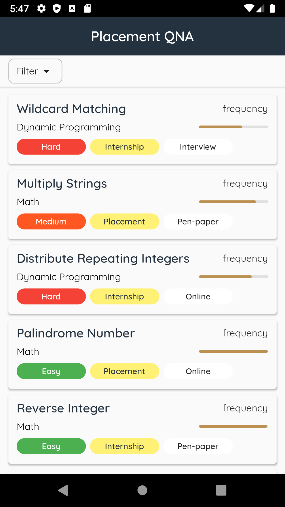
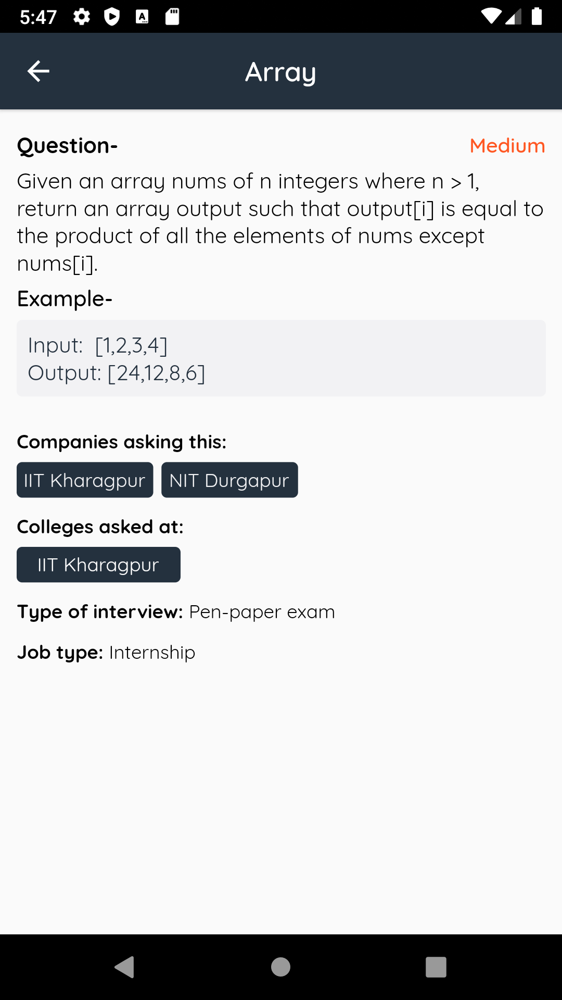
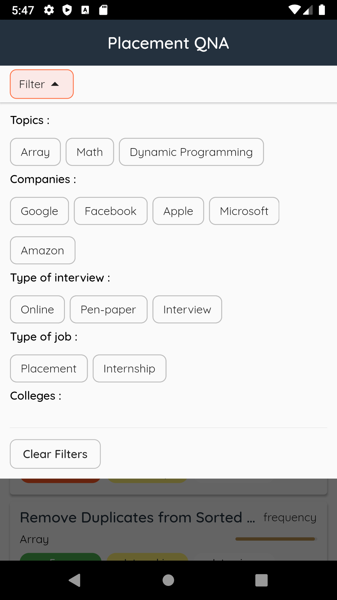

# Demux Academy Project

 The landing page of an App which displays the questions asked in this year’s campus placements across India.

## Features:

Ths project has several features:
- In `HomePage` each question has a title, frequency, topics and a few tags like difficulty, type of interview and type of job
- Real time update from Cloud Firestore using Streams
- Detailed question with example
- Filter results on the basis of topics, companies, type of interview, type of job and colleges
- Intuitive and Responsive design with instant loading and filter functionalities
- Made with `Flutter`, a cross-platform application development framework.

## Screenshots

 
<table><tr>
 <td style="text-align: center">
 
 </td>
 <td style="text-align: center">
 
 </td>
 <td style="text-align: center">
 
 </td>
 </tr></table>
 

